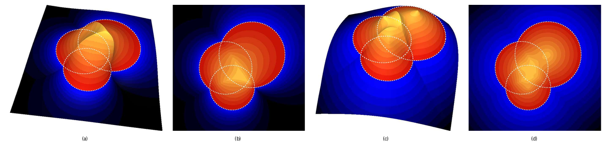
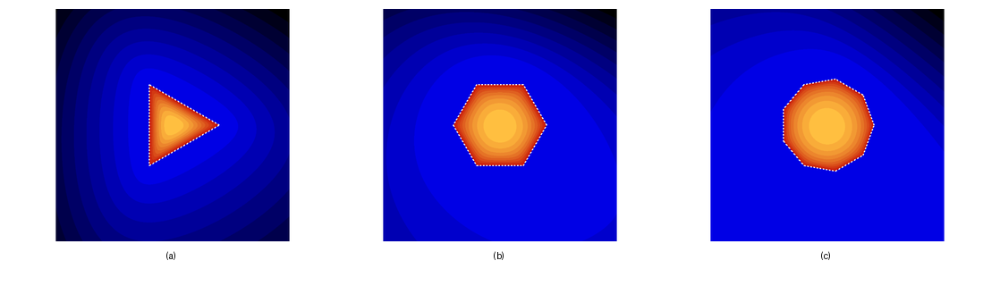
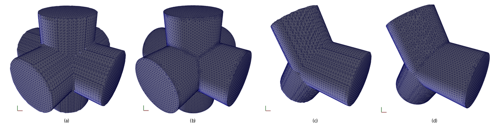
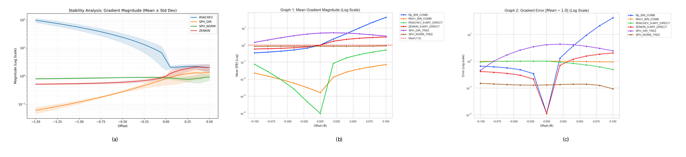
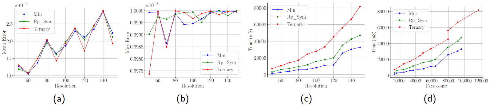

# Constructing Associative Ternary R-functions

Reference implementation for the paper **“Constructing Associative Ternary R-functions: A Geometric Perspective”**.
The code implements and visualizes ternary and N-ary R-function formulations for implicit modeling, with a focus on spherical-simplex-based ternary composition, scalar-field regularity, gradient stability, and CAD-style triple-junction reconstruction.

<p align="center">
  
</p>

## Citation

If you find this paper or code useful for your research, please cite our work:

```bibtex
@article{ternary_r_functions_2026,
  title   = {Constructing Associative Ternary R-functions: A Geometric Perspective},
  author  = {Yohan Fougerolle, Joaquin Rodriguez, Aurore Gabon, Johan Gielis},
  journal = {Computer-aided design (CAD)},
  year    = {2026}
}
```

## Overview

Classical R-functions provide continuous implicit representations of Boolean operations between primitives, but repeated binary compositions introduce order-dependent scalar fields. Even when the zero level set is correct, the field itself may become asymmetric, poorly conditioned, or numerically inconvenient for optimization and reconstruction.

<p align="center">
  
</p>

This repository explores a geometric alternative based on **ternary R-functions**. The proposed operator reinterprets logical composition through the geometry of a spherical simplex on $S^{2}$. The implementation provides:

- classical binary R-functions, including $R_{p}$ and $R_{0,m}$;
- N-ary reference formulations, including Rvachev- and Zenkin-style operators;
- the proposed normalized spherical ternary operator;
- OpenGL/FreeGLUT visualization of scalar fields and meshes;
- Marching Cubes extraction for implicit CAD scenes;
- mesh cleanup, valence optimization, smoothing, and Newton-Raphson projection back to the implicit zero set.

## Repository structure

```text
.
├── AppConfig.cpp/.h         # Interface for simple textual configuration files and scripts 
├── AppController.cpp/.h     # Application state, benchmarks, scene generation, interaction callbacks
├── CAD_Scene.h              # Composite implicit scene and choice of Boolean/R-function logic
├── GLScene.cpp/.h           # OpenGL/FreeGLUT rendering and visualization context
├── ImplicitObjects.cpp/.h   # Implicit primitives such as spheres, planes, and cylinders
├── MarchingCubes.cpp/.h     # Isosurface extraction and local mesh refinement utilities
├── Mesh.cpp/.h              # Triangular mesh data structure, I/O, normals, statistics, cleanup
├── NeighborMesh.cpp/.h      # Mesh adjacency maps and neighborhood-based topology operations
├── Rfunctions.cpp/.h        # Classical, N-ary, and spherical ternary R-function implementations
├── main.cpp                 # Current executable entry point
├── CMakeLists.txt           # CMake build configuration
└── LICENSE                  # Project license
```

## Requirements

The project is written in **C++17** and uses CMake. The current build file requires:

- CMake >= 3.16
- A C++17 compiler, for example `g++` or `clang++`
- OpenGL
- GLU
- FreeGLUT / GLUT
- Eigen3

## Building from Source (Windows / Visual Studio)

This project uses **vcpkg** to manage its third-party dependencies (`yaml-cpp` and `Eigen3`). Follow these steps to configure the environment and compile the project inside Microsoft Visual Studio.

### 1. Install and Configure vcpkg

Open a standard PowerShell terminal and run the following commands to clone and boostrap vcpkg:

```powershell
# Clone the official Microsoft vcpkg repository
git clone [https://github.com/microsoft/vcpkg.git](https://github.com/microsoft/vcpkg.git)
cd vcpkg

# Bootstrap the package manager to generate the executable
.\bootstrap-vcpkg.bat

# Optional: Integrate vcpkg with your local user account 
# (This allows Visual Studio to automatically find vcpkg libraries)
.\vcpkg integrate install

On Ubuntu/Debian, the dependencies can be installed with:

```bash
sudo apt update
sudo apt install \
  build-essential \
  cmake \
  libeigen3-dev \
  freeglut3-dev \
  libgl1-mesa-dev \
  libglu1-mesa-dev \
  mesa-common-dev
```

## Compilation

From the repository root:

```bash
mkdir -p build
cd build
cmake .. -DCMAKE_BUILD_TYPE=Release
cmake --build . -j$(nproc)
```

## Running the demo

Run the executable from the build directory:

```bash
cd build && ./TernaryRFunctions
```

The active `main.cpp` is configured for the CAD junction demonstration:

```cpp
app.currentMode = AppController::SceneMode::CADjunction;
app.m_objects = app.MakeTripleJunctionScene(JunctionType::X_JUNCTION);
app.setLogic(LogicType::TERNARY_KRF);
int gridResolution = 80;
```

This mode builds a triple-cylinder junction, extracts its zero level set with Marching Cubes, applies mesh cleanup and optimization, projects the vertices back to the implicit surface, and opens an OpenGL viewer.

### Useful runtime controls

| Key | Action |
|---:|---|
| `+` | Zoom in |
| `-` | Zoom out |
| `r` | Reset view rotation/translation |
| `w` | Wireframe rendering |
| `f` | Filled mesh rendering |
| `Esc` | Close the application |

When using non-CAD visualization modes, additional controls are available:

| Key | Action |
|---:|---|
| `0`–`7` | Switch between evaluated R-function variants |
| `i` | Toggle intersection / union |
| `p` | Toggle flat / 3D scalar-field rendering |

## Switching experiments

The repository contains several modes through `AppController::SceneMode`:

```cpp
AppController::SceneMode::ClassicalExample
AppController::SceneMode::BenchmarkGradient
AppController::SceneMode::BenchmarkGradientUnbalancedTree
AppController::SceneMode::NaryExample
AppController::SceneMode::CADjunction
```

The current executable uses the CAD junction path. To reproduce other experiments, edit `main.cpp` and select the corresponding `SceneMode`, scene constructor, and logic type.

The main logic options are:

```cpp
LogicType::MIN_NAIVE   // Classical min/max logic
LogicType::BINARY_RP   // Symmetrized binary Rp composition
LogicType::TERNARY_KRF // Proposed normalized spherical ternary operator
```

For the CAD case, the junction geometry can be changed by switching:

```cpp
app.MakeTripleJunctionScene(JunctionType::X_JUNCTION);
app.MakeTripleJunctionScene(JunctionType::Y_JUNCTION);
```

## Method

The method addresses a structural limitation of binary R-function trees. Pairwise compositions are not scalar-field associative: different binary aggregation orders may represent the same Boolean set but produce different field values and gradients away from the zero level set. This becomes problematic for implicit modeling pipelines relying on stable gradients, for example Newton projection, mesh relaxation, or optimization.

The proposed formulation builds a ternary operator from spherical-simplex geometry. Given the values of three implicit primitives, the vector of signs and magnitudes is mapped to a direction on the sphere. The operator evaluates an opening parameter associated with a spherical simplex and compares it to a reference threshold. The normalized version multiplies the directional output by the input norm, restoring a distance-like behavior and a quasi-unit gradient near the zero level set.

In implementation terms, the central class is `RCore::SphericalEvaluator`, which exposes:

```cpp
double Compute(bool isIntersection, const Eigen::VectorXd& X);
double ComputeNormalized(bool isIntersection, const Eigen::VectorXd& X);
```

The normalized spherical operator is used in `CAD_Scene::Evaluate()` when `LogicType::TERNARY_KRF` is selected.

## Mesh reconstruction pipeline

The CAD demo performs the following steps:

1. Assemble an implicit triple-junction scene from cylinders.
2. Evaluate the selected R-function composition over a 3D grid.
3. Extract the zero level set using Marching Cubes.
4. Weld near-duplicate vertices and remove degenerate structures.
5. Optimize mesh valence by local edge flips.
6. Collapse parasitic and very small triangles.
7. Apply tangential smoothing.
8. Project vertices back to the zero level set using Newton-Raphson updates.
9. Refine sharp features and sanitize high-aspect-ratio elements.
10. Render the optimized mesh in OpenGL.

<p align="center">
  
</p>

## Results reported in the paper

The paper evaluates the proposed formulation through gradient analysis, runtime comparison, Newton-Raphson convergence, and CAD reconstruction.

### Gradient behavior

The normalized spherical ternary operator gives a more regular field profile than the non-normalized directional version. It avoids far-field flattening and provides a more predictable gradient magnitude around the zero level set. The experiments compare the proposed method with binary \(R_p\), \(R_{0,m}\), Rvachev N-ary, and Zenkin N-ary formulations.

<p align="center">
  
</p>

### Newton-Raphson convergence

On a $100^{3}$ grid for a three-primitive composite scene, the normalized spherical version reaches **100% convergence**, with an average of **4.64 iterations** and an average residual of **6.51e-08**. In the same benchmark, the unnormalized directional version suffers from far-field gradient vanishing and fails on a large fraction of the sampled points.

### CAD reconstruction

For triple-junction reconstruction, the ternary operator maintains low geometric error across tested resolutions. The reported mean geometric error is approximately **1.87e-09**, while preserving sharper junction behavior than simpler max/min logic. The paper reports an expected runtime overhead of about **2.75×** compared with max logic, with runtime comparable to the symmetrized \(R_p\) variant.

<p align="center">
  
</p>

The additional mesh resolution produced by the ternary operator reflects its ability to preserve a sharper and more distinct potential field around singular junctions, which triggers adaptive refinement and improves topological fidelity.

## License

This project is distributed under the **MIT License**. See [`LICENSE`](LICENSE) for details.
